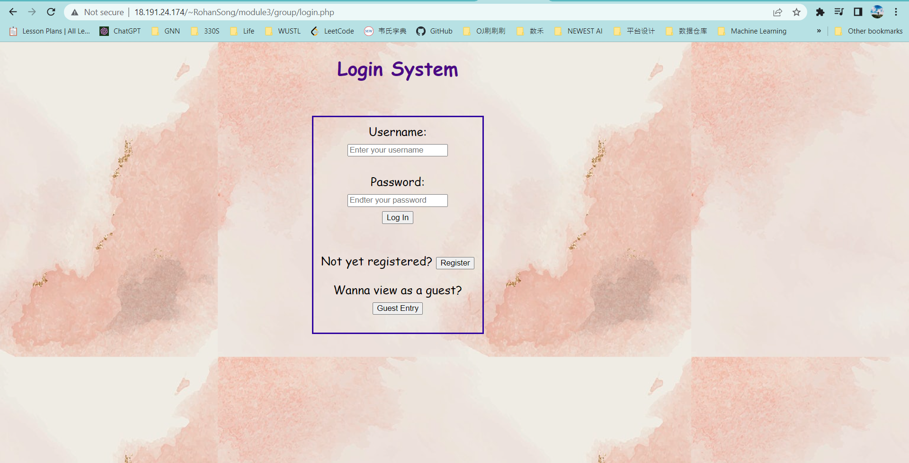

# CSE330
- Name: Fiona & Rohan

# Link
### RohanSong
http://18.191.24.174/~RohanSong/module3/group/login.php

##### Here is our login page, you can start here.

# Requirements

### News Site (60 Points)

##### User Management (20 Points):
- [x] A session is created when a user logs in (3 points)
- [x] New users can register (3 points)
- [x] Passwords are hashed, salted, and checked securely (3 points)
- [x] Users can log out (3 points)
- [x] A user can edit and delete his/her own stories and comments but cannot edit or delete the stories or comments of another user (8 points)

##### Story and Comment Management (20 Points):
- [x] Relational database is configured with correct data types and foreign keys (4 points)
- [x] Stories can be posted (3 points)
- [x] A link can be associated with each story, and is stored in a separate database field from the story (3 points)
- [x] Comments can be posted in association with a story (4 points)
- [x] Stories can be edited and deleted (3 points)
- [x] Comments can be edited and deleted (3 points)

##### Best Practices (15 Points):
- [x] Code is well formatted and easy to read, with proper commenting (3 points)
- [x] Safe from SQL Injection attacks (2 points)
- [x] Site follows the FIEO philosophy (3 points)
- [x] All pages pass the W3C HTML and CSS validators (2 points)
- [x] CSRF tokens are passed when creating, editing, and deleting comments and stories (5 points)

##### Usability (5 Points):
- [x] Site is intuitive to use and navigate (4 points)
- [x] Site is visually appealing (1 point)

##### Creative Portion (15 Points)
- [x] We provide the functionality to allow the users to have a deep look at the main page (for example, like time, comments, and number of clicks)
- [x] We also support the hottest news rankings, to be specific, we let the users sort whatever by date or by clicks.
- [x] In addition, we make users a detailed page, so that users can look at their homepage to see the detailed information.

