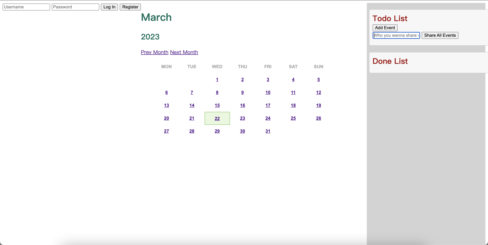

# CSE330
- Name: Fiona & Rohan

# Link
### RohanSong
http://18.222.253.115/~RohanSong/module5/group/main.html

##### Here is our main page, you can start here.

# Requirements

### News Site (60 Points)

# Calendar View (10 Points):
- The calendar is displayed as a table grid with days as the columns and weeks as the rows, one month at a time (5 points)
- The user can view different months as far in the past or future as desired (5 points)

# User and Event Management (25 Points):
- Events can be added, modified, and deleted (5 points)
- Events have a title, date, and time (2 points)
- Users can log into the site, and they cannot view or manipulate events associated with other users (8 points)
- Don't fall into the Abuse of Functionality trap! Check user credentials on the server side as well as on the client side.
- All actions are performed over AJAX, without ever needing to reload the page (7 points)
- Refreshing the page does not log a user out (3 points)

# Best Practices (20 Points):
- Code is well formatted and easy to read, with proper commenting (2 points)
- If storing passwords, they are stored salted and hashed (2 points)
- All AJAX requests that either contain sensitive information or modify something on the server are performed via POST, not GET (3 points)
- Safe from XSS attacks; that is, all content is escaped on output (3 points)
- Safe from SQL Injection attacks (2 points)
- CSRF tokens are passed when adding/editing/deleting events (3 points)
- Session cookie is HTTP-Only (3 points)
- Page passes the W3C validator (2 points)

# Usability (5 Points):
- Site is intuitive to use and navigate (4 points)
- Site is visually appealing (1 point)

##### Creative Portion (15 Points)
- [x] Users can share their calendars with additional users.
- [x] We have created a to-do list and a done list, where users can change the current event status of events by clicking on them.
- [x] We have enriched the content of events by creating event categories.

